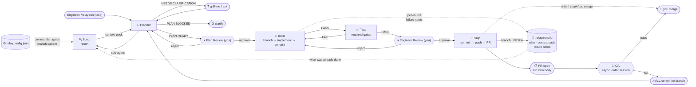

# Relay

**Relay** is a Claude Code plugin that takes a **task** and drives it through
**Plan → Build → Test → Engineer Review → Ship**, auto-looping on failure — a relay of
single-purpose agents passing the work down the line. Give it a task; the Planner drafts a plan
you approve, then it builds. One project-agnostic workflow that reads each project's own
`CLAUDE.md` to learn how *that* project builds and tests.

> **⚠️ v3.0.0 changes the default behavior.** Relay now stops at the **pull request** instead of
> merging. To keep the old behavior, add `{"ship": {"stopAfter": "merge"}}` to `relay.config.json`.
> See [Where Relay stops](#where-relay-stops).

## Install

```
/plugin marketplace add el-varquez/relay
/plugin install relay@relay
```

Then, from inside any project:

```
/relay:init            # optional, once — profiles the project and writes relay.config.json
/relay:run "<a task or problem>"
```

Just describe the task — the Planner recons the code, drafts a plan, and you approve it before any building. (Want it to build on an existing plan or spec? Mention that file's path in the task.)

## The flow



*Renders as a diagram in Obsidian, GitHub, and most Markdown viewers. Build↔Test loops until Test passes — it only pauses for you if Build genuinely stalls.*

<details>
<summary>Plain-text version</summary>

- **Engineer** runs `/relay:run "<task>"`.
- **Planner** (`relay:plan`) reads the project's `CLAUDE.md`, spawns the **Scout** (`relay:scout`) sub-agent to recon the code, then drafts a lean plan → you approve/edit it at **Plan Review**. If it has open questions it asks first (via `grill-me` if installed) until you share understanding.
- **Build** (`relay:build`) branches off the default branch, implements there + compiles → **Test** (`relay:test`) runs the project's gates.
- Test fail → back to Build. Test pass → **Engineer Review** (you). Reject → back to Build.
- Approve → **Ship**: commit → push → PR. It stops there by default; you merge when QA clears it.
- If QA rejects, re-run `/relay:run "<their feedback>"` **from that branch** — Relay reads the diff and the run state, plans a fix, and pushes to the same PR.

</details>

## How it works

- **Task-driven.** Give Relay a task — the **Planner** (`relay:plan`) reads the project's `CLAUDE.md`,
  recons the code via its Scout sub-agent (`relay:scout`), and drafts a **lean**, grounded plan for
  you to approve before any building starts. It works from the task's **subtasks** (which already
  encode the acceptance criteria — so it won't re-ask about AC). If Scout's recon shows the scope
  isn't easily implementable, it asks first — via `grill-me` if installed, otherwise plain questions
  — to agree on **how** to implement.
- **Project-agnostic, with an optional config.** Nothing is hardcoded. Relay reads *this* project's
  `CLAUDE.md` for conventions, and an optional `relay.config.json` for the parts that should be
  executed rather than interpreted. See [Config](#config).
- **Read-only recon + verify around one writer.** `relay:scout` recons the code for the Planner;
  `relay:test` verifies the *result* after Build. Only `relay:build` edits code — enforced by
  tool scope.
- **Never builds on your default branch.** Build's one git write is the **work branch**: it branches
  off the default branch before editing, named by your config or project convention, otherwise
  derived from the task.
- **Nothing commits until Ship.** Build only edits the working tree — it never commits, pushes, or
  merges. All changes are committed once, at Ship, after your approval.
- **Persistent Build.** The Build agent is continued across retries, so it remembers prior
  attempts. Both fail loop-backs feed it. It loops Build↔Test until green — pausing only if it
  genuinely stalls.
- **Runs survive session death.** Every run writes its plan, context pack, and per-round failure
  notes to `.relay/runs/<id>/`, and stamps the run id into the PR body. A QA rejection days later
  picks up from there instead of starting over.

## Config

`relay.config.json` is **optional**. Without it, Relay behaves exactly as it always has. With it,
the parts of the pipeline that shouldn't be guesswork stop being guesswork — and Scout skips its
discovery pass entirely, which is the bulk of its cost on every run.

```json
{
  "commands": { "build": "pnpm build", "test": "pnpm test", "lint": "pnpm lint" },
  "gates":    { "required": ["build", "lint"], "advisory": ["test"] },
  "git":      { "defaultBranch": "main", "branchPattern": "<type>/<ticket>-<slug>" },
  "ship":     { "stopAfter": "pr" }
}
```

Run `/relay:init` to generate it — Scout profiles the project and you correct a draft rather than
authoring a blank file. Every field is optional; delete one to restore discovery for it.

The rule that keeps it from duplicating `CLAUDE.md`:

> **Config holds what the harness EXECUTES. `CLAUDE.md` holds what the agent must UNDERSTAND.**

Exact commands, branch patterns, and gate lists go in the config. Domain language, architecture
rules, and "why this build path is fragile" stay in `CLAUDE.md`. It's per-project, never global,
and it sits beside your `CLAUDE.md` rather than replacing it.

**`gates`** are the pass bar: a red **required** gate sends Build back around; a red **advisory**
gate is reported but doesn't block — for a flaky suite, or a change the tests can't cover.

**Poly-repo** projects add a `repos` array with optional per-repo command overrides and `dependsOn`
ordering. Build then uses the same branch name across every repo it touches, and Ship opens one PR
per repo in dependency order. Omit `repos` and none of that machinery exists.

Full schema: [`skills/run/references/relay-config.md`](skills/run/references/relay-config.md).

## Where Relay stops

`ship.stopAfter` decides how far Ship goes. **The default is `pr`.**

| Value | Ship does |
|---|---|
| `commit` | commit locally, stop |
| `push` | commit + push the branch, stop |
| **`pr`** | commit + push + open the PR, stop **(default)** |
| `merge` | all of the above, then merge |

Merging to `main` shouldn't be something a plugin does by default. Branch protection is the usual
counter-argument, but it has a gap that matters: it blocks juniors, not code owners — and admins
typically bypass it, while repos with no protection configured have nothing to catch it at all.
The costs are asymmetric too. Stopping one step early costs you one `gh pr merge`; merging one step
early costs a revert on `main`.

If `stopAfter` is `merge` and branch protection rejects the merge, that's reported as *"PR ready —
merge blocked by branch protection"* and Relay exits clean. It isn't treated as a build failure.

## When QA rejects

Because Relay stops at the PR, QA usually happens later — often in a different session, after the
Build agent is long gone. To pick it back up, get on the branch and run Relay again with the feedback:

```
git checkout feature/ABC-123-the-thing
/relay:run "QA: the button still shows for archived projects"
```

Relay notices you're on a non-default branch with a matching run and **continues it**: Scout reads
`git diff` plus the previous run's state (including what was tried **and rejected**), the Planner
scopes a fix with the shipped work marked out of scope, Build stays on the branch, and Ship pushes
to the **same PR**. You confirm the detection at the plan gate, so a wrong guess never gets far.

## Stages

| Stage | Writes? | Job | Passes when |
|-------|---------|-----|-------------|
| Plan | no | Planner reads CLAUDE.md, recons via Scout, drafts a lean plan; asks questions until aligned | you + Planner share understanding of the approach |
| Scout | no | recon sub-agent — explores code + establishes build/test/lint commands for the Planner | context pack → `RECON DONE` |
| Build | yes | branch off the default branch, implement the plan there, then compile | clean compile → `PASS` |
| Test  | no | run the project's required gates | every required gate green → `PASS` |
| Review| — | the mandatory human gate | you approve |
| Ship  | git | commit → push → PR (→ merge, if configured) | PR open |

## Notes

- **Run state** lands in `./.relay/runs/<date>-<slug>/` per project — add `.relay/` to `.gitignore`.
- **Git conventions** follow *your* config, then your project or global `CLAUDE.md` — the workflow
  imposes none of its own. Build reads the **branch naming** rule; Ship reads **commit-message
  style** and any co-author/trailer policy.
- **A successful run means "there's a PR waiting on you"** — not "it's merged." That's deliberate;
  see [Where Relay stops](#where-relay-stops).
- Requires Claude Code with plugin support.

## Credits

- Inspired by [IndyDevDan](https://www.youtube.com/@indydevdan)'s **Agentic Developer Workflow (ADW)** concept.

## License

MIT © 2026 el-varquez
