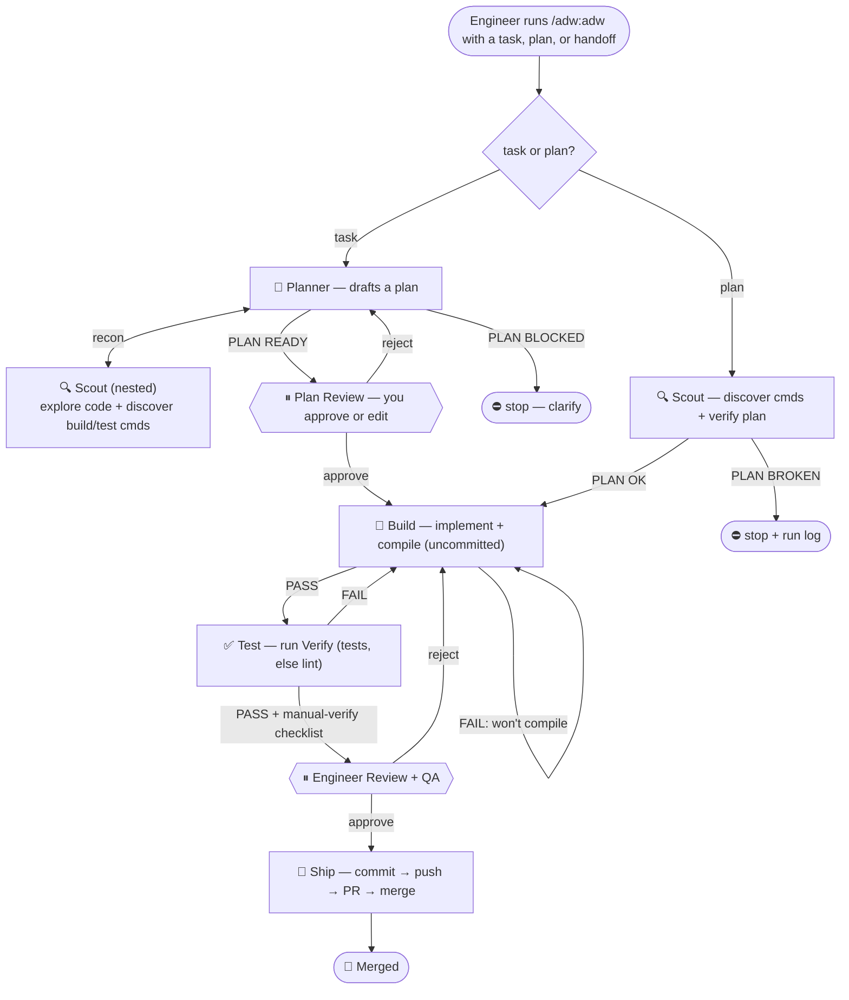

# ADW — AI Development Workflow

A Claude Code plugin that takes an **approved plan or handoff** and drives it through
**Scout → Build → Test → Engineer Review → Ship**, auto-looping on failure. One
project-agnostic workflow that reads each project's own `CLAUDE.md` to learn how *that*
project builds and tests.

## Install

```
/plugin marketplace add el-varquez/adw
/plugin install adw@adw
```

Then, from inside any project:

```
/adw:adw "<a task or problem>"            # NEW: ADW plans it for you first
/adw:adw <path-to-plan-or-handoff>        # or hand it an existing plan
/adw:adw <task-or-plan> --max-rounds 5
```

No plan yet? Just pass the task — the Planner drafts one and you approve it before any building.

## The flow



*Renders as a diagram in Obsidian, GitHub, and most Markdown viewers. Build↔Test auto-loops at most 3 rounds (`--max-rounds N`), then escalates to you.*

<details>
<summary>Plain-text version</summary>

```
Engineer: /adw:adw <task | plan | handoff>
    │
    │  task?  → 🧭 PLANNER  recons via nested 🔍 Scout → drafts a plan
    │             → ⏸ PLAN REVIEW  (you approve / edit the plan) ──┐
    │  plan?  → 🔍 SCOUT  read-only · discover cmds + verify plan ──┤
    │             PLAN BROKEN → stop + run log                      │
    ▼                                                               ▼
🔨 BUILD   the only writer · implement + compile · leaves edits uncommitted   ◀─┐  fail: loop back
    │  PASS                                                                      │  (same agent)
    ▼                                                                            │
✅ TEST    read-only · run plan's Verify (tests, else compile+lint) ────────────┘
    │  PASS (+ manual-verify checklist)
    ▼
⏸  ENGINEER REVIEW + QA   QA runs the checklist here · approve = QA + Eng sign-off
    │  approve                          reject(reason) → loop back to Build
    ▼
🚢 SHIP    commit → push → PR → merge (per the project's git rules)

Build↔Test auto-loops at most 3 rounds (--max-rounds N), then escalates to you.
```

</details>

## How it works

- **Task or plan.** Give ADW a finished plan, or just a task — the **Planner** agent recons the
  code (via a nested Scout) and drafts a grounded plan for you to approve before any building
  starts. It uses `superpowers:writing-plans` if installed, otherwise plans plainly.
- **Project-agnostic.** Nothing is hardcoded. The orchestrator (your Claude Code session)
  reads *this* project's `CLAUDE.md` for build/test/lint commands and git conventions, then
  delegates to subagents.
- **Two read-only verifiers bracket one writer.** `adw:adw-scout` verifies the *plan* before
  Build; `adw:adw-test` verifies the *result* after. Only `adw:adw-build` edits code — enforced
  by tool scope.
- **QA is part of Review.** The Engineer Review gate is where QA runs the manual-verify
  checklist. Approval means QA + engineer signed off — that authorizes Ship.
- **Persistent Build.** The Build agent is continued across retries, so it remembers prior
  attempts. Both fail loop-backs feed it. Cap: 3 rounds, then it escalates to you.
- **Nothing commits until Ship.** Build only edits the working tree — it never commits, branches,
  or pushes. All changes are committed once, at Ship, after Engineer + QA approval.

## Stages

| Stage | Writes? | Job | Passes when |
|-------|---------|-----|-------------|
| Plan *(task mode)* | no | Planner turns a task into a grounded plan, reconning via Scout | you approve the plan |
| Scout | no | discover build/test/lint cmds; verify plan vs code; emit context pack | plan actionable → `PLAN OK` |
| Build | yes | implement the plan, then compile | clean compile → `PASS` |
| Test  | no | run the plan's Verify (tests, else compile + lint) | every gate green → `PASS` |
| Review| — | the mandatory human gate; QA tests here | you approve with QA sign-off |
| Ship  | git | commit → push → PR → merge | merged |

## Notes

- **Run logs** land in `./.adw/runs/<date>-<slug>.md` per project.
- **Git conventions** (branch naming, commit-message style, co-author trailers) follow *your*
  project or global `CLAUDE.md` — the workflow imposes none of its own.
- Requires Claude Code with plugin support.

## Credits

- Inspired by [IndyDevDan](https://www.youtube.com/@indydevdan)'s **Agentic Developer Workflow (ADW)** concept.

## License

MIT © 2026 el-varquez
