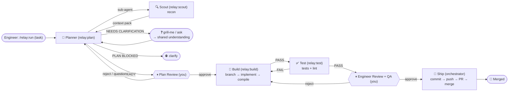

# Relay

**Relay** is a Claude Code plugin that takes a **task** and drives it through
**Plan → Build → Test → Engineer Review → Ship**, auto-looping on failure — a relay of
single-purpose agents passing the work down the line. Give it a task; the Planner drafts a plan
you approve, then it builds. One project-agnostic workflow that reads each project's own
`CLAUDE.md` to learn how *that* project builds and tests.

## Install

```
/plugin marketplace add el-varquez/relay
/plugin install relay@relay
```

Then, from inside any project:

```
/relay:run "<a task or problem>"
```

Just describe the task — the Planner recons the code, drafts a plan, and you approve it before any building. (Want it to build on an existing plan or spec? Mention that file's path in the task.)

## The flow



*Renders as a diagram in Obsidian, GitHub, and most Markdown viewers. Scout (`relay:scout`) is the Planner's read-only recon sub-agent. Build↔Test loops until Test passes — it only pauses for you if Build genuinely stalls.*

<details>
<summary>Plain-text version</summary>

- **Engineer** runs `/relay:run "<task>"`.
- **Planner** (`relay:plan`) reads the project's `CLAUDE.md`, spawns the **Scout** (`relay:scout`) sub-agent to recon the code, then drafts a lean plan → you approve/edit it at **Plan Review**. If it has open questions it asks first (via `grill-me` if installed) until you share understanding; if the task is truly infeasible it reports blocked.
- **Build** (`relay:build`) branches off the default branch, implements there + compiles → **Test** (`relay:test`) runs tests + lint.
- Test fail → back to Build. Test pass → **Engineer Review + QA** (you). Reject → back to Build.
- Approve → **Ship** (orchestrator): commit → push → PR → merge.
- Build↔Test loops until Test passes (it only pauses for you if Build genuinely stalls).

</details>

## How it works

- **Task-driven.** Give Relay a task — the **Planner** (`relay:plan`) reads the project's `CLAUDE.md`,
  recons the code via its Scout sub-agent (`relay:scout`), and drafts a **lean**, grounded plan for
  you to approve before any building starts. It works from the task's **subtasks** (which already
  encode the acceptance criteria — so it won't re-ask about AC). If Scout's recon shows the scope
  isn't easily implementable, it asks first — via `grill-me` if installed, otherwise plain questions
  — to agree on **how** to implement. The bar to proceed is that shared understanding of the
  approach, not a checklist that every criterion is covered.
- **Project-agnostic.** Nothing is hardcoded. The orchestrator (your Claude Code session)
  reads *this* project's `CLAUDE.md` for build/test/lint commands and git conventions, then
  delegates to subagents.
- **Read-only recon + verify around one writer.** `relay:scout` recons the code for the Planner;
  `relay:test` verifies the *result* after Build. Only `relay:build` edits code — enforced by
  tool scope.
- **QA is part of Review.** The Engineer Review gate is where QA runs the manual-verify
  checklist. Approval means QA + engineer signed off — that authorizes Ship.
- **Persistent Build.** The Build agent is continued across retries, so it remembers prior
  attempts. Both fail loop-backs feed it. It loops Build↔Test until green — pausing only if it
  genuinely stalls.
- **Never builds on your default branch.** Build's one git write is the **work branch**: it branches
  off the default branch before editing, named by your project's convention if it states one,
  otherwise derived from the task (`feature/ABC-123-short-slug`).
- **Nothing commits until Ship.** Build only edits the working tree — it never commits, pushes, or
  merges. All changes are committed once, at Ship, on the branch Build made, after Engineer + QA
  approval.

## Stages

| Stage | Writes? | Job | Passes when |
|-------|---------|-----|-------------|
| Plan | no | Planner reads CLAUDE.md, recons via Scout, drafts a lean plan; asks questions until aligned | you + Planner share understanding of the approach |
| Scout | no | recon sub-agent — explores code + discovers build/test/lint cmds for the Planner | context pack → `RECON DONE` |
| Build | yes | branch off the default branch, implement the plan there, then compile | clean compile → `PASS` |
| Test  | no | run the plan's Verify — tests + lint | every gate green → `PASS` |
| Review| — | the mandatory human gate; QA tests here | you approve with QA sign-off |
| Ship  | git | commit → push → PR → merge | merged |

## Notes

- **Run logs** land in `./.relay/runs/<date>-<slug>.md` per project.
- **Git conventions** follow *your* project or global `CLAUDE.md` — the workflow imposes none of
  its own. Build reads the **branch naming** rule; Ship reads **commit-message style** and any
  co-author/trailer policy.
- Requires Claude Code with plugin support.

## Credits

- Inspired by [IndyDevDan](https://www.youtube.com/@indydevdan)'s **Agentic Developer Workflow (ADW)** concept.

## License

MIT © 2026 el-varquez
